# Qraft.ai

**Turn any URL into a scannable piece of art.**

You give it a link and a prompt like _"a Japanese village with cherry blossoms in the snow"_, and it gives you back an artistic yet scannable QR code — generated by Stable Diffusion, structurally constrained by two ControlNets, verified by real QR decoders, and repaired when the art fights the code.

<p align="center">
  <a href="https://d2od1bio0etyqy.cloudfront.net/">
    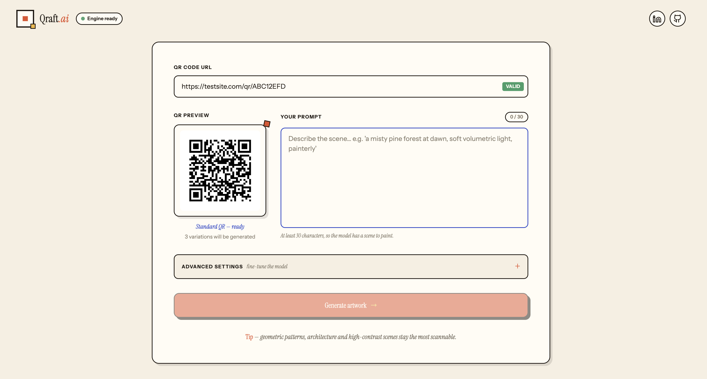
  </a>
</p>

<p align="center">
  
  
  
  
  
</p>

> **[Try the live demo](https://d2od1bio0etyqy.cloudfront.net/)** — the GPU fleet scales to zero when idle, so if the engine is asleep you can request activation from the site (a human approves it; more on that below).

<p align="center">
  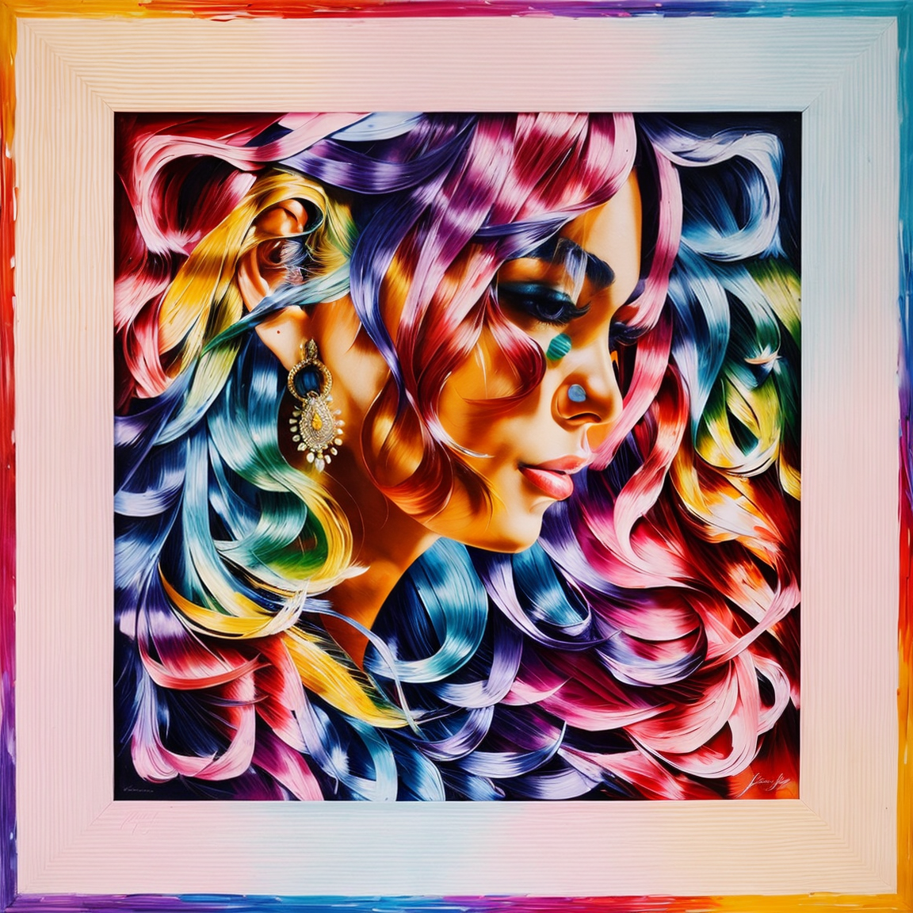
  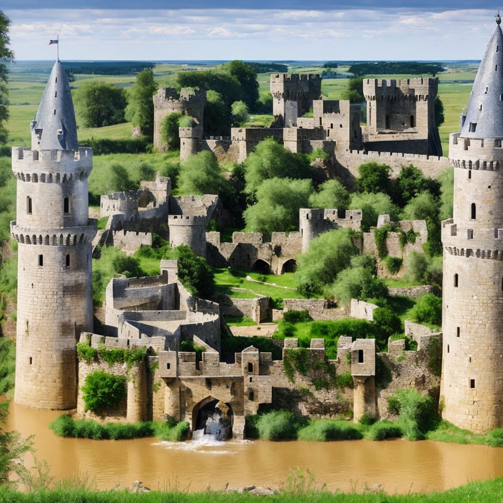
  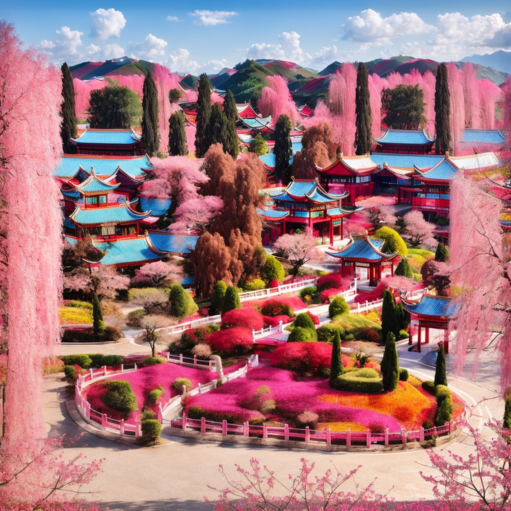
  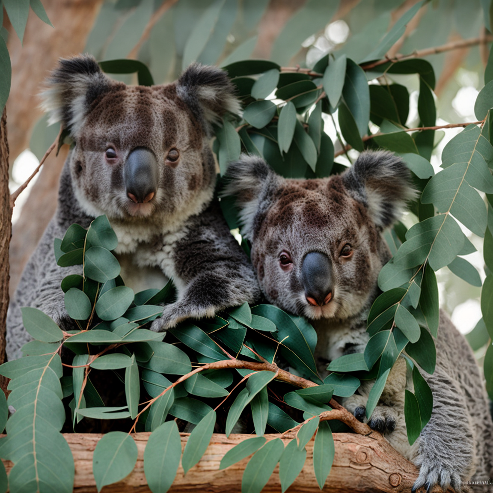
  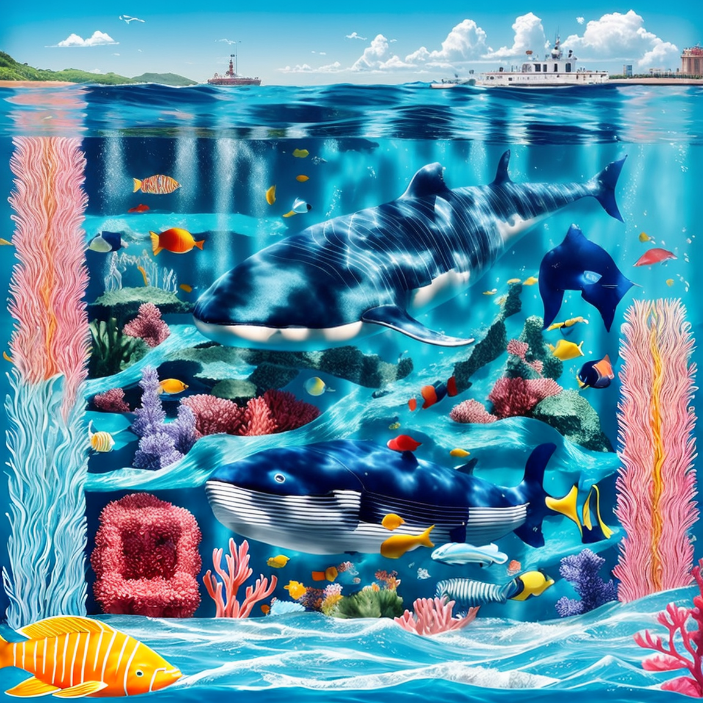
  
  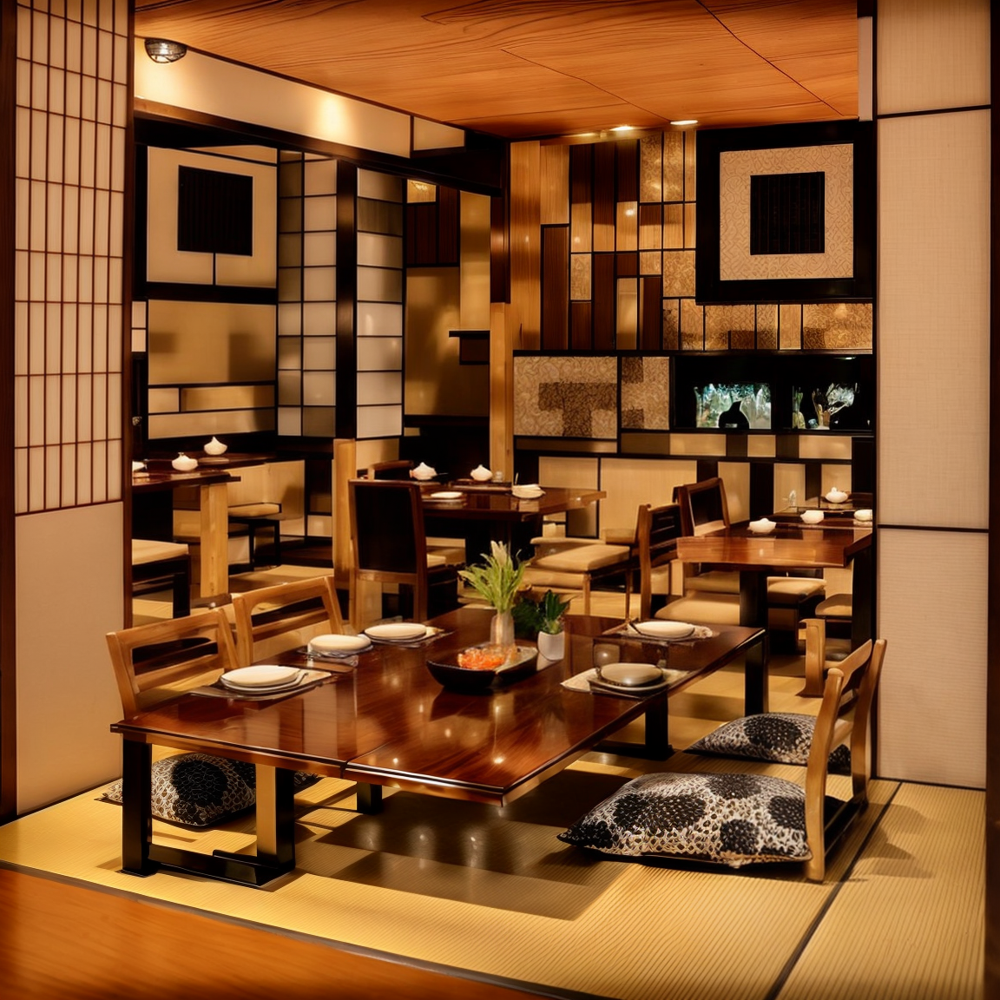
  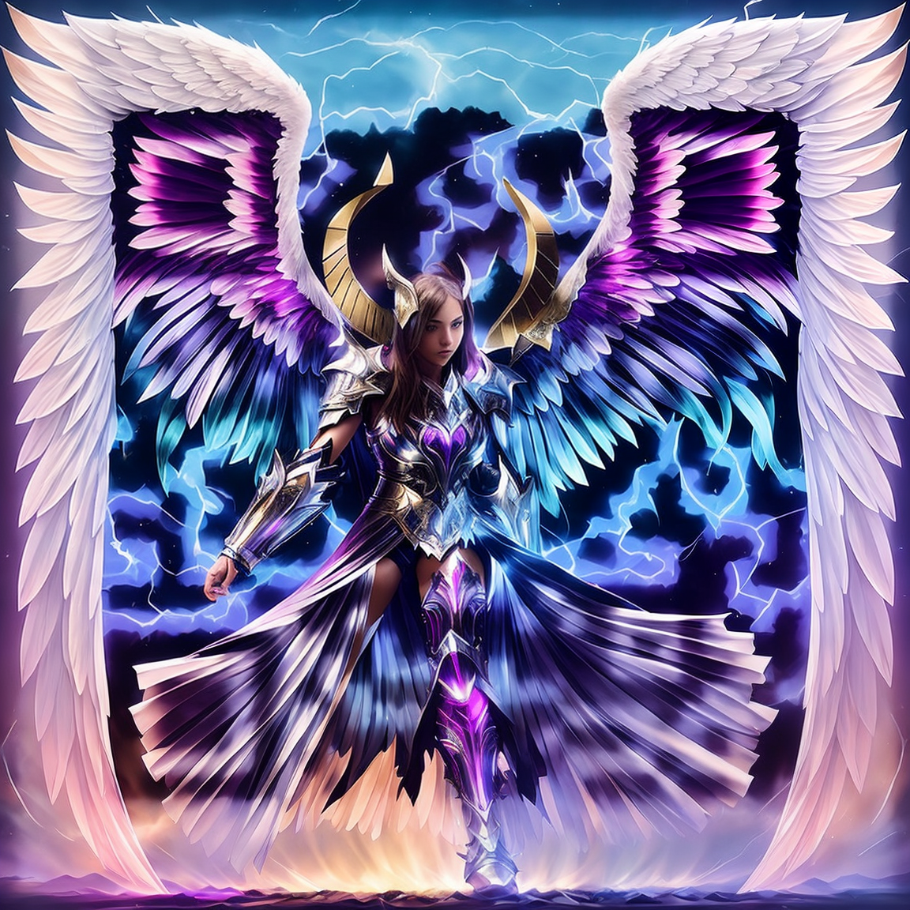
</p>

<p align="center"><em>All of these are real, scannable QR codes. Point your camera at one.</em></p>

---

## Table of contents

- [The product in 60 seconds](#the-product-in-60-seconds)
- [System architecture](#system-architecture)
- [Life of a generation request](#life-of-a-generation-request)
- [The generation engine](#the-generation-engine)
  - [Why QR codes are hard for diffusion models](#why-qr-codes-are-hard-for-diffusion-models)
  - [The models](#the-models)
  - [Pipeline v2 — scannable by construction](#pipeline-v2--scannable-by-construction)
  - [Scan verification](#scan-verification)
  - [The repair ladder](#the-repair-ladder)
  - [Style presets](#style-presets)
  - [LLM prompt enhancement](#llm-prompt-enhancement)
  - [Parameter cheat sheet](#parameter-cheat-sheet)
- [The API](#the-api)
- [Security model](#security-model)
- [Scaling and cost engineering](#scaling-and-cost-engineering)
- [The frontend](#the-frontend)
- [Environments and deployment](#environments-and-deployment)
- [Local development](#local-development)
- [Testing and evaluation](#testing-and-evaluation)
- [Repository layout](#repository-layout)
- [Limitations and known issues](#limitations-and-known-issues)
- [Acknowledgements](#acknowledgements)

---

## The product in 60 seconds

A visitor types a URL and an art prompt. The browser renders the QR code locally, uploads it, and submits an async generation job. Because the GPU may be asleep (scale-to-zero), the UI is built around **waiting states that don't feel broken**: a wake screen when the engine is off, and a processing screen that entertains you with real examples from previous generations while yours cooks for a couple of minutes. When the job completes you land on a shareable result page with your artworks, ready to download and scan.

The deployed site exposes a few flavors of the same app:

| Route                         | What it is                                                                         |
| ----------------------------- | ---------------------------------------------------------------------------------- |
| `/`                           | The public generator — v2 pipeline against the production GPU endpoint             |
| `/j/<jobId>`                  | Result/processing page for a job (shareable; polling is token-guarded)             |
| `/staging`, `/staging/j/<id>` | Same UI pointed at the **staging** endpoint, legacy v1 pipeline                    |
| `/lab`                        | v2 pipeline against staging — where new pipeline work is validated                 |
| `/admin`                      | Operations panel: endpoint status, scale up/down, GPU hardware selector, job stats |

Everything below the form is asynchronous: no request ever waits on a GPU synchronously, and no visitor can call the scaling API directly — capacity is driven by queued work and capped at a small maximum.

---

## System architecture

Three apps in a Turborepo/pnpm monorepo (workspace name `qr-controlnet`), four AWS moving parts, one flow: **browser → Lambda → queue → GPU → S3**.

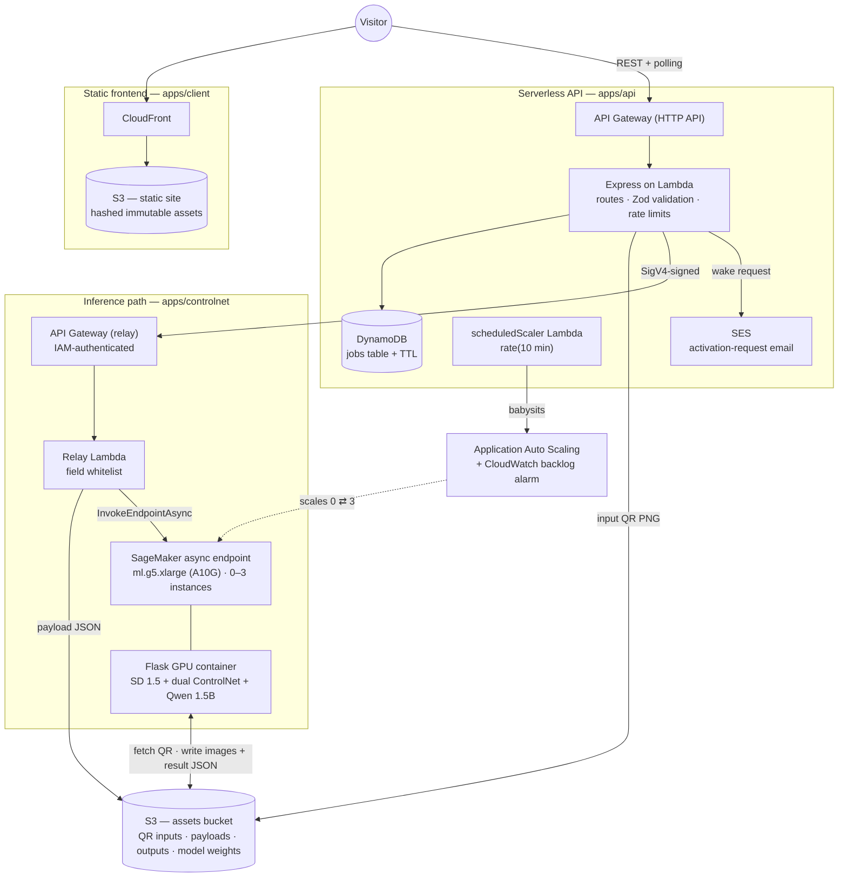
```mermaid
flowchart TB
    User(("Visitor"))

    subgraph Static["Static frontend — apps/client"]
        CF["CloudFront"]
        S3Web[("S3 — static site<br/>hashed immutable assets")]
    end

    subgraph Api["Serverless API — apps/api"]
        APIGW["API Gateway (HTTP API)"]
        Express["Express on Lambda<br/>routes · Zod validation · rate limits"]
        DDB[("DynamoDB<br/>jobs table + TTL")]
        Cron["scheduledScaler Lambda<br/>rate(10 min)"]
        SES["SES<br/>activation-request email"]
    end

    subgraph Infer["Inference path — apps/controlnet"]
        RelayGW["API Gateway (relay)<br/>IAM-authenticated"]
        Relay["Relay Lambda<br/>field whitelist"]
        SM["SageMaker async endpoint<br/>ml.g5.xlarge (A10G) · 0–3 instances"]
        Container["Flask GPU container<br/>SD 1.5 + dual ControlNet + Qwen 1.5B"]
    end

    S3A[("S3 — assets bucket<br/>QR inputs · payloads · outputs · model weights")]
    AAS["Application Auto Scaling<br/>+ CloudWatch backlog alarm"]

    User --> CF --> S3Web
    User -- "REST + polling" --> APIGW --> Express
    Express --> DDB
    Express -- "input QR PNG" --> S3A
    Express -- "SigV4-signed" --> RelayGW --> Relay
    Relay -- "payload JSON" --> S3A
    Relay -- "InvokeEndpointAsync" --> SM
    SM --- Container
    Container <-- "fetch QR · write images + result JSON" --> S3A
    Express -- "wake request" --> SES
    Cron -- "babysits" --> AAS
    AAS -. "scales 0 ⇄ 3" .-> SM
```

| Layer               | Path                                                             | Stack                                                                                                   | Deployed as                                                                          |
| ------------------- | ---------------------------------------------------------------- | ------------------------------------------------------------------------------------------------------- | ------------------------------------------------------------------------------------ |
| **Frontend**        | [`apps/client/`](apps/client/)                                   | Astro + React islands, Tailwind                                                                         | Static build on S3 behind CloudFront                                                 |
| **API**             | [`apps/api/`](apps/api/)                                         | Express (runs identically as local server and Lambda), aws-sdk, Zod                                     | Lambda + HTTP API via Serverless Framework, plus a cron Lambda                       |
| **ML inference**    | [`apps/controlnet/`](apps/controlnet/)                           | Python/Flask, PyTorch 2.6, diffusers, transformers                                                      | SageMaker-compatible Docker image (`/ping`, `/invocations`) on an **async** endpoint |
| **Relay**           | [`apps/controlnet/app/lambda.py`](apps/controlnet/app/lambda.py) | Plain boto3 Lambda                                                                                      | Hand-managed function behind its own API Gateway (`make deploy-relay-lambda`)        |
| **Shared packages** | [`packages/`](packages/)                                         | `@repo/shared-types`, `@repo/validation-schemas` (Zod), `@repo/qr-constants`, `@repo/typescript-config` | Consumed by client and API; built before every deploy                                |

Two design decisions explain most of the topology:

1. **SageMaker Async Inference, not real-time.** A generation takes 30–120+ seconds and the endpoint may need ~3–4 minutes to boot from zero. API Gateway and Lambda cap out around 30 s, so synchronous inference is impossible — instead, requests are queued as S3 objects (`InvokeEndpointAsync`), the queue absorbs cold starts, and the queue depth itself becomes the autoscaling signal.
2. **A thin relay Lambda between the API and SageMaker.** The relay owns the SageMaker invocation: it writes the payload JSON to S3, calls `InvokeEndpointAsync`, and returns the `OutputLocation` the API will poll. It also **whitelists request fields**, so nothing undeclared can reach the GPU container. The Express API talks to it through an IAM-authenticated API Gateway using SigV4-signed requests.

One convention to know when reading the code: the **public API speaks camelCase** (`baseQrCode`, `numInferenceSteps`) and the **container speaks snake_case** (`base_qr_code`, `num_inference_steps`). The translation happens once, in the API's `ControlNetService`, and the relay whitelist is part of that contract.

---

## Life of a generation request

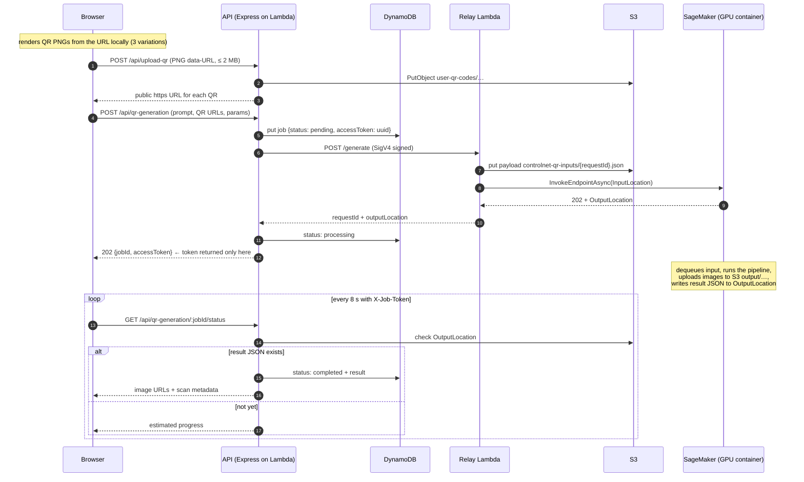
```mermaid
sequenceDiagram
    autonumber
    participant B as Browser
    participant A as API (Express on Lambda)
    participant D as DynamoDB
    participant R as Relay Lambda
    participant S3 as S3
    participant SM as SageMaker (GPU container)

    Note over B: renders QR PNGs from the URL locally (3 variations)
    B->>A: POST /api/upload-qr (PNG data-URL, ≤ 2 MB)
    A->>S3: PutObject user-qr-codes/…
    A-->>B: public https URL for each QR
    B->>A: POST /api/qr-generation (prompt, QR URLs, params)
    A->>D: put job {status: pending, accessToken: uuid}
    A->>R: POST /generate (SigV4 signed)
    R->>S3: put payload controlnet-qr-inputs/{requestId}.json
    R->>SM: InvokeEndpointAsync(InputLocation)
    SM-->>R: 202 + OutputLocation
    R-->>A: requestId + outputLocation
    A->>D: status: processing
    A-->>B: 202 {jobId, accessToken} ← token returned only here
    Note over SM: dequeues input, runs the pipeline,<br/>uploads images to S3 output/…,<br/>writes result JSON to OutputLocation
    loop every 8 s with X-Job-Token
        B->>A: GET /api/qr-generation/:jobId/status
        A->>S3: check OutputLocation
        alt result JSON exists
            A->>D: status: completed + result
            A-->>B: image URLs + scan metadata
        else not yet
            A-->>B: estimated progress
        end
    end
```

A few details worth knowing:

- **The status poll is the state machine's engine.** Nothing pushes completion events; the API discovers results lazily when a poll arrives, by checking whether SageMaker has written the result JSON to the job's `OutputLocation`. Progress percentages before that are honest estimates (time-based, capped at 95%).
- **Failure is bounded twice**: a job flips to `failed` after 15 consecutive unreadable status checks, or after a 10-minute wall clock (`GENERATION_TIMEOUT_MS`) — whichever comes first. This backstop matters because a container that crashes writes nothing to the success path.
- **Jobs are ephemeral by design.** DynamoDB TTL evicts them (~30 min for pending/completed, ~60 min for failed). The output images in S3 are what persists.

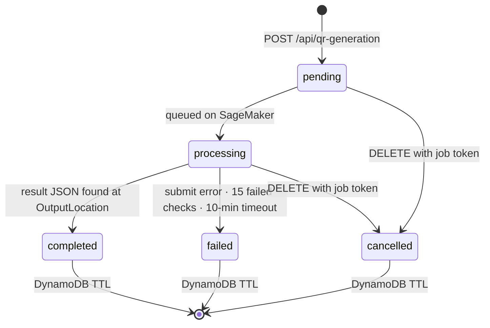
```mermaid
stateDiagram-v2
    [*] --> pending: POST /api/qr-generation
    pending --> processing: queued on SageMaker
    processing --> completed: result JSON found at OutputLocation
    processing --> failed: submit error · 15 failed checks · 10-min timeout
    pending --> cancelled: DELETE with job token
    processing --> cancelled: DELETE with job token
    completed --> [*]: DynamoDB TTL
    failed --> [*]: DynamoDB TTL
    cancelled --> [*]: DynamoDB TTL
```

---

## The generation engine

### Why QR codes are hard for diffusion models

A QR code is a rigid black-and-white grid with strict local contrast requirements; a diffusion model wants to paint. Left alone, Stable Diffusion will happily smear the finder patterns into clouds. The classic fix is **ControlNet conditioning** — but one ControlNet is not enough: the structure net alone produces scannable-but-flat images, and turning it down produces beautiful-but-dead codes. Qraft runs **two ControlNets simultaneously**, and (in the v2 pipeline) closes the loop with actual QR decoders that verify and repair every image.

### The models

| Role                      | Model                                          | Notes                                                                                                                                                                                                                                             |
| ------------------------- | ---------------------------------------------- | ------------------------------------------------------------------------------------------------------------------------------------------------------------------------------------------------------------------------------------------------- |
| Base checkpoint           | `emilianJR/epiCRealism` (default)              | SD 1.5 family; **9 checkpoints** are registered (DreamShaper, GhostMix, MeinaMix, CyberRealistic, AbsoluteReality, …) and stored in S3 — the container downloads and hot-swaps them at runtime, so a style change never requires an image rebuild |
| ControlNet 1 — structure  | `monster-labs/control_v1p_sd15_qrcode_monster` | Trained to preserve QR geometry; its conditioning scale is the main scannability ↔ artistic-freedom dial                                                                                                                                         |
| ControlNet 2 — brightness | `latentcat/control_v1p_sd15_brightness`        | Global lighting/contrast guidance so scanners keep enough dynamic range                                                                                                                                                                           |
| Prompt enhancer           | `Qwen/Qwen2.5-1.5B-Instruct`                   | Small instruct LLM co-resident on the same GPU (plan 009)                                                                                                                                                                                         |
| Scan verifiers            | OpenCV `wechat_qrcode` (CNN) + `zxing-cpp`     | Not generative — these are the judges                                                                                                                                                                                                             |

The Docker image (PyTorch 2.6 / CUDA 12.4) bakes in only the two ControlNets — they're shared by every style. Base checkpoints and the LLM sync from S3 at startup (`ENABLE_S3_MODEL_LOADING`), which keeps the image stable while models iterate.

Everything runs fp16 on a single GPU (~10 GB VRAM for the dual-ControlNet pipe), with the DPM++ 2M Karras scheduler by default and `max_concurrent_invocations_per_instance = 1` — one generation owns the GPU at a time.

### Pipeline v2 — scannable by construction

Two pipelines coexist behind one request field. `pipeline: "v1"` (the default when absent) is the legacy path: condition directly on the uploaded QR image at 1024², attach scan metadata, ship. The public site runs **`pipeline: "v2"`** (plan 008), which restructures generation around one idea: _never condition on a photo of a QR code when you can condition on the QR code itself._

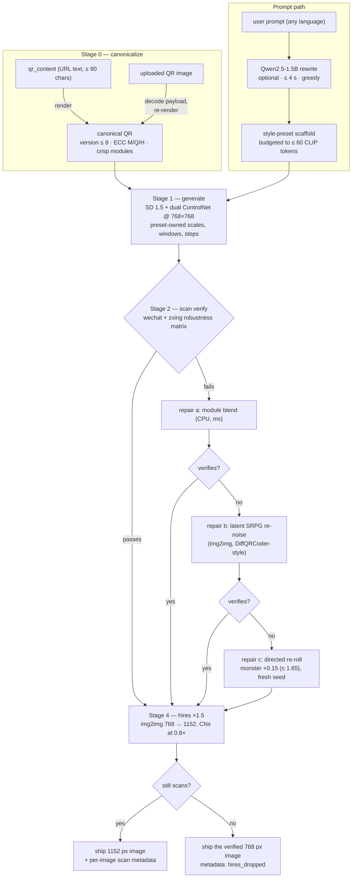
```mermaid
flowchart TB
    subgraph S0["Stage 0 — canonicalize"]
        direction LR
        QC["qr_content (URL text, ≤ 90 chars)"] -- "render" --> CAN["canonical QR<br/>version ≤ 8 · ECC M/Q/H · crisp modules"]
        BQ["uploaded QR image"] -- "decode payload,<br/>re-render" --> CAN
    end

    subgraph SP["Prompt path"]
        UP["user prompt (any language)"] --> LLM["Qwen2.5-1.5B rewrite<br/>optional · ≤ 4 s · greedy"]
        LLM --> SCAF["style-preset scaffold<br/>budgeted to ≤ 60 CLIP tokens"]
    end

    CAN --> GEN
    SCAF --> GEN["Stage 1 — generate<br/>SD 1.5 + dual ControlNet @ 768×768<br/>preset-owned scales, windows, steps"]
    GEN --> V{"Stage 2 — scan verify<br/>wechat + zxing robustness matrix"}
    V -- "passes" --> HIRES
    V -- "fails" --> R1["repair a: module blend (CPU, ms)"]
    R1 --> R1V{"verifies?"} -- "no" --> R2["repair b: latent SRPG re-noise<br/>(img2img, DiffQRCoder-style)"]
    R2 --> R2V{"verifies?"} -- "no" --> R3["repair c: directed re-roll<br/>monster +0.15 (≤ 1.65), fresh seed"]
    R1V -- "yes" --> HIRES
    R2V -- "yes" --> HIRES
    R3 --> HIRES["Stage 4 — hires ×1.5<br/>img2img 768 → 1152, CNs at 0.8×"]
    HIRES --> HV{"still scans?"}
    HV -- "yes" --> OUT["ship 1152 px image<br/>+ per-image scan metadata"]
    HV -- "no" --> OUT2["ship the verified 768 px image<br/>metadata: hires_dropped"]
```

Stage by stage:

- **Stage 0 — canonicalization.** The client sends the QR's _text payload_ (`qrContent`), and the container renders a pristine QR from it: smallest version ≤ 8 that fits, the highest error-correction level the version allows (never L), pixel-perfect module edges. If only an image is available, it's decoded and re-rendered. The ControlNet then sees an ideal conditioning signal instead of an anti-aliased upload. If nothing is canonicalizable, the request degrades gracefully to the v1 path.
- **Stage 1 — generation at 768².** SD 1.5's native regime (1024² asks the checkpoint to extrapolate). At 768 the structure net needs less force, which buys back artistic freedom. Parameters are owned by the style preset here — user sliders rule only in v1.
- **Stage 2 — verification** (below).
- **Stage 3 — the repair ladder** (below), only for images that failed verification.
- **Stage 4 — hires.** An img2img ×1.5 upscale (768 → 1152) at strength 0.40 with both ControlNets re-applied at 0.8× the preset scales, conditioned on the canonical QR NEAREST-upscaled to match. The upscale is accepted **only if it doesn't degrade the scan verdict** — otherwise the verified 768 image ships and the metadata says `hires_dropped: true`. Scannability always outranks resolution.

### Scan verification

Every generated image is scored by the two strongest open-source decoders — OpenCV's `wechat_qrcode` (CNN detector + super-resolution, the same engine family the client uses, so browser and server verdicts agree) and `zxing-cpp` — across a small robustness matrix (native and half size, mild blur variants: a proxy for "will a phone at arm's length read this?"). The result is per-image metadata the API forwards verbatim:

```json
{
  "scan_verified": true,
  "scan_score": 0.83,
  "decoders_passed": ["wechat", "zxing"],
  "repair_stage_used": null,
  "pipeline": "v2",
  "style_preset": "illustration",
  "seed": 12346
}
```

Three strictness levels (`relaxed` / `standard` / `strict`) set which decoders must pass and how much repair is allowed. Verification is deliberately **metadata-only and can never fail a generation** — every verifier code path is wrapped so a broken decoder degrades to "unknown", not to a failed job.

### The repair ladder

When a v2 image fails verification, a bounded ladder runs — cheapest rung first, re-verifying after each, stopping at the first success, all under a **90-second wall-clock budget** per image:

| Rung | Technique              | Cost                  | Idea                                                                                                                                                                                                 |
| ---- | ---------------------- | --------------------- | ---------------------------------------------------------------------------------------------------------------------------------------------------------------------------------------------------- |
| a    | **Module blend**       | CPU, milliseconds     | Compare the image against the canonical QR module-by-module; nudge the luminance of only the failing modules toward legibility                                                                       |
| b    | **Latent SRPG repair** | GPU, one img2img pass | Re-noise to strength 0.40 and re-denoise for 40 steps under Scanning-Robust Perceptual Guidance (after DiffQRCoder, WACV 2025), with an optional SR-MPGD latent polish behind `V2_SRMPGD_ITERATIONS` |
| c    | **Directed re-roll**   | GPU, full generation  | Regenerate with the structure ControlNet bumped +0.15 (capped at 1.65) and a decorrelated seed — trade beauty for readability, but only when asked                                                   |

The ladder never returns an image that scans _worse_ than what entered it: best-so-far wins.

### Style presets

In v2 the preset — not the user — owns conditioning scales, guidance windows, step count and checkpoint. Values are research-seeded (qrcode-monster model card, DiffQRCoder, Anthony Fu's QR-code writings) and tuned against the eval harness:

| Preset         | Checkpoint      | Structure scale | Brightness scale (window) | Prompt scaffold                                                                                                      |
| -------------- | --------------- | --------------- | ------------------------- | -------------------------------------------------------------------------------------------------------------------- |
| `illustration` | DreamShaper     | 1.35            | 0.28 (30–90%)             | "vibrant detailed illustration of …, intricate linework, storybook art"                                              |
| `photo`        | epiCRealism     | **1.40**        | 0.22 (35–90%)             | "professional photograph of …, natural lighting, 35mm" — realism fights the grid hardest, so the strongest hand      |
| `cyberpunk`    | CyberRealistic  | 1.30            | 0.30 (25–85%)             | "…, neon lights, rain-slick streets, high contrast" — neon scenes carry QR structure naturally, so the lightest hand |
| `watercolor`   | MeinaMix        | **1.45**        | 0.30 (30–95%)             | "delicate watercolor painting of …, soft washes" — soft washes blur module edges, needs the most structure           |
| `architecture` | AbsoluteReality | 1.35            | 0.20 (35–90%)             | "dramatic architectural view of …, geometric facades, golden hour"                                                   |
| `none`         | request default | 1.35            | 0.25 (30–90%)             | passthrough                                                                                                          |

The common thread: the structure net runs the **full** denoising window, while the brightness net joins late and leaves early — enough to keep global contrast, never enough to flatten the art.

### LLM prompt enhancement

Short prompts ("un gato") make poor tag prompts for SD 1.5. When the user leaves **"enhance my prompt"** on (the default), a Qwen2.5-1.5B-Instruct model — sharing the GPU with SD — rewrites the prompt into an English tag-style prompt: subject preserved, language translated, texture/quality modifiers appended.

The engineering constraints are stricter than the model choice:

- **Never breaks a generation**: any failure (model load, timeout at 4 s, degenerate output) falls back to a rules-based enhancer, then to the original prompt verbatim. A load failure is sticky so a broken LLM isn't retried on every request.
- **Deterministic**: greedy decoding — the same prompt always enhances identically, so per-seed reproducibility survives.
- **Budgeted**: the final composed prompt (enhancement + preset scaffold) is trimmed to ≤ 60 of CLIP's 77 tokens, so scaffolds never get truncated away.
- **Transparent**: the enhanced text lives only inside the container and its logs. The public contract — job status, DynamoDB, results — always carries the user's original prompt.
- **Kill-switchable**: `PROMPT_ENHANCEMENT_ENABLED=False` on the endpoint disables it globally without touching the image (an `--update-only` redeploy flips the env var).

### Parameter cheat sheet

What actually gets sent, and by whom:

| Parameter                       | Container default (v1) | Public form sends | v2 preset overrides?                       |
| ------------------------------- | ---------------------- | ----------------- | ------------------------------------------ |
| `controlnet_conditioning_scale` | `[1.25, 0.1]`          | `[1.0, 0.1]`      | ✅ per preset (1.30–1.45 / 0.20–0.30)      |
| `control_guidance_start / end`  | `[0, 0.1]` / `[1, 1]`  | same              | ✅ monster full-window, brightness ~30–90% |
| `num_inference_steps`           | 30                     | 40                | ✅ 36                                      |
| `guidance_scale`                | 7.0                    | 8.5               | ✅ 7.0                                     |
| `sampler`                       | `dpm++_2m_karras`      | same              | —                                          |
| `width × height`                | 1024²                  | 1024²             | ✅ clamped to 768², hires to 1152²         |
| `num_images_per_prompt`         | —                      | 3                 | —                                          |
| `prompt_enhancement`            | off                    | **on**            | —                                          |

Reading the two scales: the first number is the structure net — **up = more scannable, down = more artistic**. The second is the brightness net, kept subtle (≈ 0.1–0.3) because it can wash out an image fast. In v1, multi-image requests explore: the first images use your scales, later ones sample alternative pairs (`[1.45, 0.1]`, `[1.0, 0.15]`, …) for variety.

---

## The API

All routes live in [`apps/api/src/routes/`](apps/api/src/routes/). The same Express app runs as a local server (`src/server.ts`) and as a Lambda handler (`src/lambda.ts`).

| Method   | Route                                            | Access                | Purpose                                                                                    |
| -------- | ------------------------------------------------ | --------------------- | ------------------------------------------------------------------------------------------ |
| `POST`   | `/api/qr-generation`                             | Public · 5 req/5 min  | Create a generation job → `202 {jobId, accessToken}`                                       |
| `GET`    | `/api/qr-generation/:jobId/status`               | **Job token**         | Poll status/result (`X-Job-Token` header or `?token=`)                                     |
| `DELETE` | `/api/qr-generation/:jobId`                      | **Job token**         | Cancel a pending/processing job                                                            |
| `POST`   | `/api/upload-qr`                                 | Public · rate limited | Store a client-rendered QR PNG (magic-byte checked, ≤ 2 MB) in S3                          |
| `GET`    | `/api/gallery/examples`                          | Public · rate limited | Real prompt+image pairs, joined from past S3 payloads and outputs                          |
| `GET`    | `/api/endpoint/status`                           | Public                | Engine state (`InService`/`Updating`/instance count/**GPU type**) — powers the wake screen |
| `GET`    | `/api/endpoint/metrics`                          | Public                | Endpoint metrics for the admin panel                                                       |
| `POST`   | `/api/endpoint/wake`                             | Public · rate limited | **Asks** for activation: emails the admin via SES; never scales anything itself            |
| `POST`   | `/api/auth/challenge` → `/api/auth/verify`       | Public                | Admin login: HMAC challenge/response → short-lived JWT                                     |
| `POST`   | `/api/endpoint/scale`                            | **Admin JWT**         | Scale to N instances (with an is-already-updating guard)                                   |
| `POST`   | `/api/endpoint/instance-type`                    | **Admin JWT**         | Blue/green switch between `ml.g5.xlarge` and `ml.g4dn.xlarge`                              |
| `GET`    | `/api/jobs`, `/api/jobs/stats`, `/api/jobs/:id`  | **Admin JWT**         | Job listing/statistics                                                                     |
| `GET`    | `/api/health` (+ `/ready`, `/live`, `/detailed`) | Public                | Health probes                                                                              |

Requests are validated by shared **Zod schemas** (`@repo/validation-schemas`) — the same package the frontend uses, so client and server can't drift. The Python container re-validates with its own marshmallow schemas, and a contract test suite keeps the two aligned.

Storage is a single DynamoDB table (id PK, a `status` GSI for the stats endpoints, TTL for eviction) — pay-per-request, no connection pooling concerns in Lambda, and no cleanup cron because expiry is native.

---

## Security model

The interesting property: **this is a public generator with no accounts**, so every boundary had to be designed without a user table (plans 003–006 in [`plans/`](plans/)).

- **Job ownership by capability token.** Job IDs are guessable; the `accessToken` (crypto-random UUID, returned exactly once at creation, compared with `timingSafeEqual`) is the real boundary. Wrong or missing token → `404`, never `403`, so the API doesn't even confirm a job exists.
- **Admin auth without passwords-over-the-wire.** `POST /auth/challenge` issues a nonce; the operator's client answers with `HMAC-SHA256(challenge, ADMIN_SECRET)`; `/auth/verify` returns a short-lived JWT (role-checked by middleware on every admin route). Secrets live in SSM Parameter Store, decrypted only inside Lambda.
- **SSRF hardening at the fetch sink.** The container downloads QR images from URLs — a classic SSRF vector. `url_guard` enforces https, resolves DNS and rejects private/link-local ranges (cloud metadata included), streams under a byte cap, and Pillow decodes under a decompression-bomb ceiling. The Zod boundary pre-filters obvious internal hosts; the container check is authoritative because that's where resolution happens.
- **Upload discipline.** `/api/upload-qr` accepts only PNG magic bytes under 2 MB — it exists to receive client-rendered QR codes, nothing else.
- **The GPU is never directly reachable by visitors.** The container sits behind SageMaker, which sits behind a relay that validates and whitelists every field. Scaling is admin-only — visitors can't scale instances, and the wake button only _emails a human_.
- **Least-privilege IAM.** The API Lambda's role enumerates exactly the SageMaker/S3/DynamoDB/SES/SSM actions it uses, scoped to the app's endpoints and bucket where the services allow it.

---

## Scaling and cost engineering

A `ml.g5.xlarge` costs real money per hour, and this is a portfolio project — the entire ops design flows from "idle must cost $0".

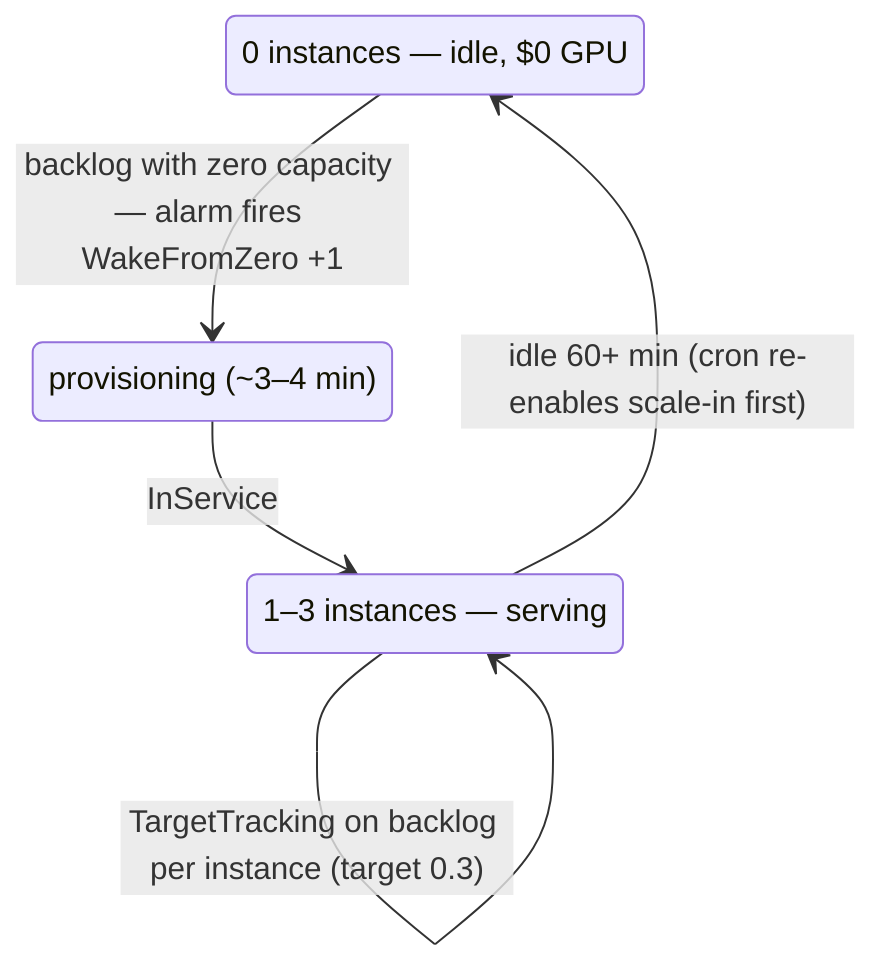
```mermaid
stateDiagram-v2
    state "0 instances — idle, $0 GPU" as zero
    state "provisioning (~3–4 min)" as boot
    state "1–3 instances — serving" as live

    zero --> boot: backlog with zero capacity — alarm fires WakeFromZero +1
    boot --> live: InService
    live --> live: TargetTracking on backlog per instance (target 0.3)
    live --> zero: idle 60+ min (cron re-enables scale-in first)
```

How the pieces fit:

- **Queue-driven autoscaling.** The async endpoint's queue depth (`ApproximateBacklogSizePerInstance`) feeds a target-tracking policy (target 0.3, scale-out cooldown 30 s, scale-in cooldown 60 min). Target tracking alone can't leave zero — no instances means no metric per instance — so a **CloudWatch alarm** (`HasBacklogWithoutCapacity`) watches for "requests queued while capacity is 0" and fires a step-scaling **WakeFromZero** policy. Min 0, max 3.
- **Human-approved wake.** Scaling from zero takes 3–4 minutes and costs money, so the site's wake button doesn't scale — it sends an SES email to the admin with the requester's message, and the admin scales from `/admin` (or `make scale-up`). The UI sets expectations honestly and the endpoint-status poll picks up the state change when it happens.
- **A self-healing cron.** Manual scale-ups suspend scale-in for 60 minutes (so the instance survives a session); the `scheduledScaler` Lambda (every 10 min) re-enables scale-in when the window passes. The same cron runs `restoreAutoscalingIfMissing`: SageMaker requires deregistering the scaling target (which deletes the policies) before an endpoint update, and policy ARNs change on recreation — so after any hardware switch the cron rebuilds the target, both policies, and re-points the wake alarm at the fresh policy ARN. Autoscaling configuration is code, not console state.
- **The GPU hardware selector.** eu-west-1 has recurring daytime capacity droughts for `g5.xlarge` (A10G 24 GB): a scale-up gets accepted, provisioning silently dies, the endpoint stays at 0 while desired reads 1. The admin panel's Hardware card flips the endpoint to `ml.g4dn.xlarge` (T4 16 GB — slower, but always available) in one click: it clones the endpoint config with the new instance type and runs a **blue/green `update-endpoint`** with `InitialInstanceCount: 1`, which doubles as a capacity test — if the new type can't provision, SageMaker auto-rolls back and the old hardware keeps serving.
- **Cold-start budget.** Boot ≈ instance provisioning + container pull + model sync from S3 + pipeline warmup. The frontend's wake/processing screens are designed around this number rather than hiding it.

---

## The frontend

Astro pages with **React islands** (`client:load`) — static HTML shell, interactivity only where the app actually needs it. State that must survive navigation (job access tokens) lives in a small localStorage job store; everything else is hooks (`useGenerationForm` as a reducer, `useJobPolling` at 8 s, `useEndpointStatus` at 30–60 s).

The visual layer is a bespoke design system ("Gallery, Alive"): warm riso palette (cream/paper/ink + blue/red/yellow/green), Instrument Serif/Sans, flat offset shadows, no gradients or blur. Tokens are Tailwind config values plus a tiny `global.css` that is **imported by the layout and bundled** — every asset the browser loads is content-hashed.

Notable components:

- **`GenerationForm`** — URL + prompt + the "enhance my prompt" toggle, with an Advanced panel exposing every knob the API accepts (model, sampler, steps, both ControlNet scales and windows, guidance, seed). It renders the QR variations client-side (no URL ever leaves the browser as plain text to a QR service) and uploads them before submitting.
- **`WakeEndpointForm`** — the scale-from-zero UX: explains that the engine is asleep, collects an email, fires the activation request.
- **`ProcessingView`** — polls the job and rotates through **real examples** (`/api/gallery/examples` joins past payload JSONs with their output images in S3) so the wait shows what's possible instead of a bare spinner.
- **`ResultDisplay`** — the artworks with scan-verified metadata and downloads (fetched `cache: 'no-store'` to dodge a subtle CORS cache-poisoning trap — see [Limitations](#limitations-and-known-issues)).
- **`AdminPanel`** — token login, environment tabs (production/staging), status card (state, instance count, **GPU row**), scale controls, and the Hardware selector.

---

## Environments and deployment

Three environments, one image, one bucket:

|        | Local                                               | Staging                                              | Production                                              |
| ------ | --------------------------------------------------- | ---------------------------------------------------- | ------------------------------------------------------- |
| Client | `localhost:3000` (Astro dev)                        | `/staging`, `/lab` routes on the deployed site       | `/`                                                     |
| API    | `localhost:3001` (`pnpm dev` / serverless-offline)  | same Lambda, `environment: "staging"` routing        | Lambda `qr-controlnet-api-prod-api`                     |
| GPU    | `localhost:8080` (docker-compose, needs NVIDIA GPU) | `controlnet-qr-endpoint-staging` (ECR tag `staging`) | `controlnet-qr-endpoint` (ECR tag `latest` / versioned) |

All ops go through the root [`Makefile`](Makefile) — `make help` lists everything.

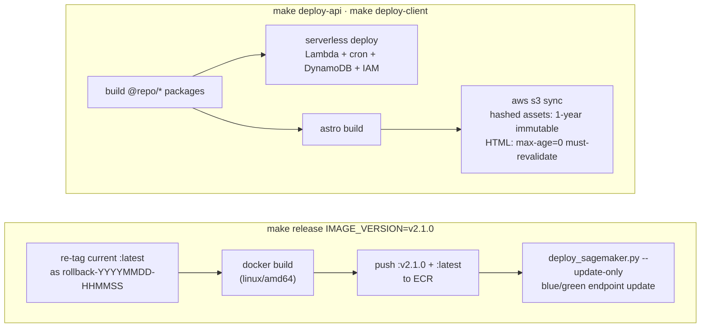
```mermaid
flowchart LR
    subgraph GPUrel["make release IMAGE_VERSION=v2.1.0"]
        direction LR
        T["re-tag current :latest<br/>as rollback-YYYYMMDD-HHMMSS"] --> BLD["docker build<br/>(linux/amd64)"] --> PUSH["push :v2.1.0 + :latest<br/>to ECR"] --> UPD["deploy_sagemaker.py --update-only<br/>blue/green endpoint update"]
    end

    subgraph JSrel["make deploy-api · make deploy-client"]
        direction LR
        PKG["build @repo/* packages"] --> SLS["serverless deploy<br/>Lambda + cron + DynamoDB + IAM"]
        PKG --> AST["astro build"] --> SYNC["aws s3 sync<br/>hashed assets: 1-year immutable<br/>HTML: max-age=0 must-revalidate"]
    end
```

- **GPU container**: `make deploy-sagemaker` (full create) or `make release IMAGE_VERSION=vX.Y.Z` (versioned blue/green update of the live endpoint — zero downtime). Every release first re-tags the current `:latest` as a `rollback-<timestamp>` image, so `make rollback ROLLBACK_TAG=…` is always one command. Staging variants exist for everything (`deploy-sagemaker-staging`, `release-staging`, …). Fresh endpoints scale themselves to 0 right after deploy.
- **API**: `make deploy-api` — Serverless Framework provisions the HTTP API, both Lambdas, the DynamoDB table and IAM. Secrets resolve from SSM at deploy time.
- **Client**: `make deploy-client` — Astro build synced to S3. The cache strategy is the deployment mechanism: hashed assets are immutable for a year, HTML always revalidates, so CloudFront needs **no invalidations** — fresh HTML simply points at fresh hashes. Corollary: never serve an un-hashed asset from a stable URL.
- **Relay Lambda**: hand-managed on purpose (it changes rarely and gates the GPU): `make deploy-relay-lambda` zips `app/lambda.py` and updates the function. Because it whitelists fields, adding a container parameter means updating it too — the Makefile documents the drift-check procedure.
- **Models**: `make upload-sd-models` pushes all nine SD checkpoints to S3; `make upload-llm-model` does the same for the prompt-enhancer weights.

---

## Local development

**Prerequisites**: Node ≥ 18 + pnpm 9, Docker (+ NVIDIA container runtime for the GPU service), Python 3.10+, an NVIDIA GPU with ~10 GB VRAM for real inference, AWS CLI only if you deploy.

```bash
git clone https://github.com/sergiocrol/qraft-ai.git
cd qraft-ai
pnpm install

# .env files (each app has a .env.example template)
make setup                      # creates minimal .env stubs
cp apps/api/.env.example apps/api/.env
cp apps/client/.env.example apps/client/.env
cp apps/controlnet/.env.example apps/controlnet/.env
```

Then run the pieces you need:

```bash
pnpm dev                        # turbo: client on :3000, api on :3001
make dev-controlnet             # GPU inference container on :8080 (docker-compose)

make test-health                # ping everything
make test-local                 # real generation against the local container
make test-api-server            # end-to-end async job through the API…
make poll-job JOB_ID=…          # …and poll it to completion
```

The API can also run in Lambda-like mode (`make start-api-production`), and the JS tests need the shared packages built once in a fresh clone: `pnpm -r --filter '@repo/*' run build`.

Root scripts: `pnpm build` · `pnpm lint` · `pnpm check-types` · `pnpm format`.

---

## Testing and evaluation

| Suite                           | Where                       | Run                                   | Covers                                                                                                                                                                                                                |
| ------------------------------- | --------------------------- | ------------------------------------- | --------------------------------------------------------------------------------------------------------------------------------------------------------------------------------------------------------------------- |
| API unit + route tests (Vitest) | `apps/api/src/**/*.test.ts` | `cd apps/api && pnpm test`            | Job manager, endpoint service, auth flows, route authz (401/403/404 semantics), gallery join, validation contract                                                                                                     |
| Container CPU suite (pytest)    | `apps/controlnet/tests/`    | `cd apps/controlnet && pytest tests/` | Request schemas, pipeline dispatch, presets, QR canonicalization, scan verifier, module repair, repair ladder, hires stage, prompt enhancer, URL guard, warmup — all with the torch stack stubbed so it runs anywhere |
| Contract alignment              | both sides                  | part of the above                     | The Zod schema and the marshmallow schema are tested against the same fixtures so camelCase/snake_case never drift                                                                                                    |
| **QR quality eval**             | `apps/controlnet/eval/`     | `make eval-qr`                        | The operator's tuning tool: runs a prompt matrix against a live container, decodes every output, writes `results.json` + a visual `report.html`. Never in CI — a full matrix is GPU time and money                    |

The eval harness is how preset numbers earn their place: change a scale, run the matrix, compare scan rates and look at the pictures.

---

## Repository layout

```
qraft-ai/
├── apps/
│   ├── client/                 # Astro + React frontend
│   │   └── src/
│   │       ├── components/     # generation/ · admin/ · wake/ · shared/
│   │       ├── hooks/          # useGenerationForm, useJobPolling, useEndpointStatus…
│   │       ├── pages/          # index · j · staging · lab · admin
│   │       ├── services/       # typed API clients (Generation, Endpoint, Auth, Gallery)
│   │       └── styles/         # design tokens (bundled by the layout)
│   ├── api/                    # Express API (local server + Lambda)
│   │   ├── src/
│   │   │   ├── routes/         # qrGeneration · qrUpload · endpoint · auth · gallery · jobs · health
│   │   │   ├── services/       # JobManager · DynamoJobStore · ControlNetService (SigV4)
│   │   │   │                   # EndpointStatusService · EmailService · GalleryService
│   │   │   └── cron.ts         # scheduledScaler — the autoscaling babysitter
│   │   └── serverless.yml      # Lambda, HTTP API, DynamoDB, IAM, cron schedule
│   └── controlnet/             # Python GPU inference container
│       ├── app/
│       │   ├── models/         # pipeline manager (S3 checkpoint loading, hot-swap)
│       │   ├── routes/         # /ping · /invocations (SageMaker contract)
│       │   ├── schemas/        # marshmallow request validation
│       │   ├── services/       # inference.py · prompt_enhancer.py · latent_repair.py
│       │   ├── utils/          # scan_verifier · qr_canonical · module_repair · url_guard…
│       │   ├── presets.py      # v2 style presets
│       │   └── lambda.py       # relay Lambda source (hand-deployed, field whitelist)
│       ├── eval/               # QR quality eval harness (make eval-qr)
│       ├── tests/              # CPU-only pytest suite
│       ├── deploy_sagemaker.py # endpoint create/update + async config + autoscaling
│       ├── serve.py            # container entrypoint
│       └── Dockerfile          # PyTorch 2.6 / CUDA 12.4; ControlNets baked in
├── packages/
│   ├── shared-types/           # request/job/result types shared by client + api
│   ├── validation-schemas/     # Zod schemas — the public API contract
│   ├── qr-constants/           # samplers, models, constraints, defaults
│   └── typescript-config/
├── plans/                      # numbered design docs (001–009) behind each feature
├── docs/                       # screenshots + example outputs
├── docker-compose.yml          # local GPU container
└── Makefile                    # every dev/build/deploy/ops command (make help)
```

The [`plans/`](plans/) directory is the project's engineering log: each numbered document is the design for a shipped slice (job submission, auth lockdown, SSRF hardening, validation alignment, wake flow, the v2 quality pipeline, prompt enhancement).

---

## Limitations and known issues

- **Cold starts are real.** 0 → 1 instance is ~3–4 minutes (provisioning + image pull + S3 model sync + warmup), and wake needs a human approval on top. The UX embraces it rather than hiding it.
- **QR density matters.** Long URLs mean denser grids and less room for art. The canonicalizer caps content at 90 chars / version 8; short URLs give the best results.
- **Beauty and scannability still trade off.** v2's verify-and-repair raises the floor substantially, but a `strict`-level guarantee costs more repair time, and some prompt/preset combinations still ship as "beautiful, scans on the second try". The per-image `scan_score` tells you which ones.
- **g5 capacity droughts.** eu-west-1 sometimes cannot provision `ml.g5.xlarge` during the day (the failure is silent: desired=1, current=0, no error anywhere). That's exactly why the admin hardware selector and the g4dn fallback exist.
- **The relay Lambda is hand-deployed.** It's tiny and changes rarely, but its field whitelist means new container parameters silently no-op in the cloud until `make deploy-relay-lambda` runs. The Makefile documents the drift check.
- **S3 image caching is aggressive.** Outputs are immutable and cached for a year; the download button fetches with `cache: 'no-store'` because a non-CORS `` response cached by the browser would otherwise poison the CORS fetch that downloads the file. If you build on this bucket, keep `Vary: Origin` in mind.

---

## Acknowledgements

This project stands on the open-source AI community:

- **[Stable Diffusion QR Code 101](https://antfu.me/posts/ai-qrcode-101)** by Anthony Fu — the primer on ControlNet QR generation, and the source of several v2 conditioning-window ideas.
- **[LogoNet: an AWS-powered application running ControlNet on SageMaker Async Endpoints](https://francescopochetti.com/logonet-the-journey-to-an-aws-powered-cloud-application-running-controlnet-on-sagemaker-async-endpoints/)** by Francesco Pochetti — the blueprint for the async-endpoint, scale-to-zero architecture used here.
- **[DiffQRCoder](https://arxiv.org/abs/2409.06355)** (WACV 2025) — Scanning-Robust Perceptual Guidance, the research behind the latent repair rung.
- **[monster-labs/control_v1p_sd15_qrcode_monster](https://huggingface.co/monster-labs/control_v1p_sd15_qrcode_monster)** and **[latentcat/control_v1p_sd15_brightness](https://huggingface.co/latentcat/control_v1p_sd15_brightness)** — the two ControlNets doing the heavy lifting.
- **[Qwen2.5](https://huggingface.co/Qwen/Qwen2.5-1.5B-Instruct)** — the prompt-enhancement LLM.
